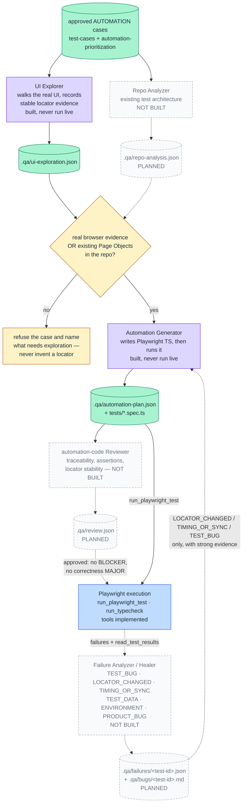

# Phase 2 pipeline — planned

What happens **after** the human approval gate. None of this runs today: `npm run qa:automation`
verifies the gate and stops. Phase 1 and the gate are in
[two-phase-workflow.md](two-phase-workflow.md); status for every box here is in
[README.md](README.md).

Sources: `../flue-qa-agents-spec-v4/agents/*.md` and `tool-contracts.json`. Every stage hands
off through a schema-validated JSON artifact on disk — never through conversation.

### The evidence gate

The point of the whole Playwright milestone: the Automation Generator **must not invent a
locator**. If neither real-browser evidence nor an existing Page Object covers a flow, it
refuses that test case and says which one needs exploration.
Rule: `src/skills/custom/locator-policy/SKILL.md`.

### The healing rule

Failure Analyzer may auto-modify a test only for `TEST_BUG`, `LOCATOR_CHANGED` and
`TIMING_OR_SYNC`, and only with strong evidence. It may never remove a valid assertion to go
green, weaken an exact expectation, add arbitrary sleeps, silently skip, swallow errors, or
turn an expected result into a product defect.

### Artifacts this phase would add

| Artifact | Produced by | Schema |
|---|---|---|
| `.qa/ui-exploration.json` | UI Explorer | `schemas/ui-exploration.schema.json` — exists |
| `.qa/automation-plan.json` | Automation Generator | `schemas/automation-plan.schema.json` — exists |
| `.qa/repo-analysis.json` | Repo Analyzer | spec pack only |
| `.qa/review.json` | automation-code Reviewer | spec pack only |
| `.qa/failures/<test-id>.json` | Failure Analyzer | spec pack only |

The spec writes **per-test** failure files plus `.qa/bugs/<test-id>.md` for `PRODUCT_BUG` — not
a single `failure-analysis.json`, despite the schema's singular name.
