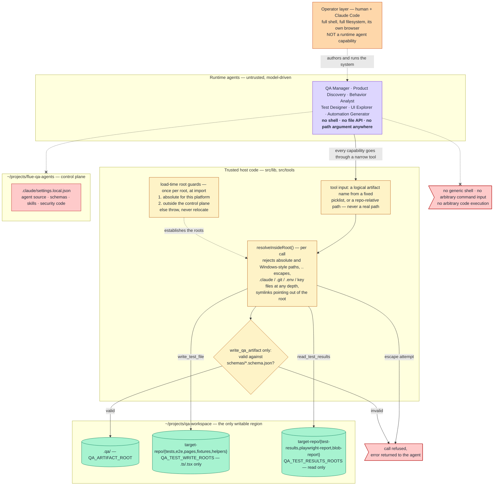
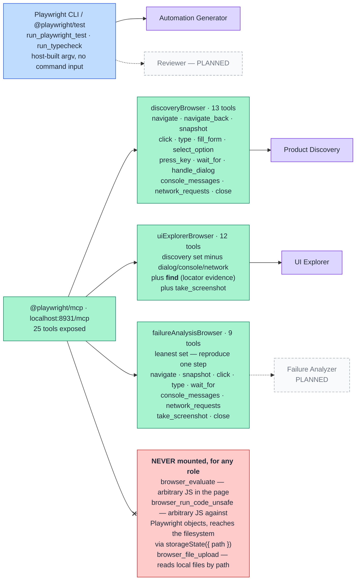

# Runtime Capability and Security Model

Runtime agents have **no shell, no filesystem API, and no path to `.claude/`**. A configured
working directory is not a security boundary — an unrestricted shell can `cd ..` around it —
so instead of a sandbox the agents get **narrow, host-controlled tools**, each mounted only on
the agents whose role needs it.

Source of truth: `src/lib/trusted-roots.ts`, `src/lib/qa-artifacts.ts`,
`src/connections/playwright-mcp.ts`, `src/skills/custom/capability-security/SKILL.md`, and
`../flue-qa-agents-spec-v4/docs/AGENT_SANDBOX_AND_TOOLS.md`.

## 1. Trust zones and the tool gateway

**Why `.claude/` is unreachable:** not by a permission rule, but because no tool can resolve
there. The artifact root is resolved relative to the module (not the current working
directory) and every root is checked at load time to be absolute *and* outside the directory
that holds `.claude/` and the security code — the process throws rather than silently
relocating. Containment is then re-checked per path with a separator-aware test, not a string
prefix.

## 2. Browser capability — per-role allowlists

The `@playwright/mcp` server exposes **25 tools**. No agent gets all of them; each role gets
the smallest set that does its job. `npm run check:playwright` verifies the allowlisted names
against the running server and reports which arbitrary-code tools the server offers and we
decline.

**Exploration and authoring never merge.** Product Discovery and UI Explorer get the
interactive browser; Automation Generator and Reviewer get the deterministic CLI/test path.
Collapsing these into one unrestricted browser/shell capability is exactly what the spec rules
out. The connection is mounted conditionally on `PLAYWRIGHT_MCP_URL`; when it is set but the
server is unreachable, the run **fails** (`optional: false`) rather than letting the model
quietly fall back to guessing.

## 3. Capability matrix — which agent holds which tool

Regenerated from the `useTool()` calls in `src/agents/*.ts` on 2026-09-22.

| Tool | QA Manager *(exp.)* | Product Discovery | Behavior Analyst | Test Designer | Automation Prioritizer | Test Case Reviewer | UI Explorer | Automation Generator |
|---|:--:|:--:|:--:|:--:|:--:|:--:|:--:|:--:|
| `read_qa_artifact` | ● | | ● | ● | ● | ● | ● | ● |
| `write_qa_artifact` — **may write only** | — | `discovered-behavior` | `requirements-analysis` | `test-cases` | `automation-prioritization` | `test-cases-review` | `ui-exploration` | `automation-plan` |
| `read_repo_file` | | | | | | | ● | ● |
| `search_repo` | | | | | | | | ● |
| `write_test_file` | | | | | | | | ● |
| `run_playwright_test` | | | | | | | | ● |
| `run_typecheck` | | | | | | | | ● |
| Playwright MCP (allowlisted) | | 5 tools | | | | | 12 tools | |
| `useSubagent` delegation | ● | | | | | | | |

**Per-agent write restriction.** Each agent's `write_qa_artifact` is built with
`writeQaArtifactToolFor([...])`, whose input schema accepts only the listed artifact name. A
reviewer asking to write `test-cases` is rejected before the tool runs. `phase1-approval.json`
is in no agent's list — only `npm run qa:approve` (host code) writes it.

Mounted on **no agent yet**: `list_repo_directory`, `read_test_results`. Planned and **not
implemented**: `modify_test_file`. Not built: Repo Analyzer, automation-code Reviewer, Failure
Analyzer. Product Discovery no longer mounts `read_qa_artifact` (it is the first stage).

## 3a. Fixed 2026-09-22 — browser agents could write into the control plane

`browser_snapshot` takes a model-chosen `filename`, and `@playwright/mcp` resolved it against
its **working directory** — which was this control-plane project, because the server was
launched from here. Confirmed by 12 agent-written snapshot files in the project root and a
controlled probe.

**Fix.** `scripts/mcp-server.mjs` is the only launcher and runs the server with
**cwd = `MCP_OUTPUT_ROOT`** (validated absolute and outside the control plane);
`scripts/lib/runtime.mjs` refuses to reuse a running server unless it can prove that server's
cwd is outside the control plane, and fails closed if it cannot tell. Verified after the fix:
a relative filename lands in `.mcp-output`, and `../flue-qa-agents/…` and absolute paths into
the project are both refused.

**Lesson.** "The agent has no file tool" was true of our tools and false of a third-party
server's tool arguments. **Any MCP tool accepting a path is a filesystem capability.**

## 4. Configured roots

| Variable | Default | Constraint |
|---|---|---|
| `QA_ARTIFACT_ROOT` | `../qa-workspace/.qa` | absolute; outside the control plane |
| `QA_TARGET_REPO_ROOT` | `../qa-workspace/target-repo` | absolute; outside the control plane; read-only except test roots |
| `QA_TEST_WRITE_ROOTS` | `tests,e2e,pages,fixtures,helpers` | repo-relative; `.ts`/`.tsx` only |
| `QA_TEST_RESULTS_ROOTS` | `test-results,playwright-report,blob-report` | repo-relative; read-only |
| `QA_TYPECHECK_SCRIPT` | unset → `npx tsc --noEmit` | host-configured argv, **no agent input** |
| `QA_TEST_RUN_TIMEOUT_MS` | `600000` | hard kill for a test/typecheck run |
| `PLAYWRIGHT_MCP_URL` | unset → no browser | `default` expands to `http://localhost:8931/mcp` |
| `QA_MCP_OUTPUT_ROOT` | `../qa-workspace/.mcp-output` | Playwright MCP working directory and output — **security boundary** (§3a) |

Both root guards run at load time for *every* root and throw rather than silently relocating.
A leftover Windows `C:\...` value is not absolute on Linux and would otherwise resolve
*inside* this project — which is precisely why the check exists.

Legend and component status: [README.md](README.md). Capability rows for agents that do not
exist yet come from `../flue-qa-agents-spec-v4`. Langfuse, when it lands, needs a decision this
model already implies: trace export belongs in the trusted host layer, not as an agent-visible
capability.
