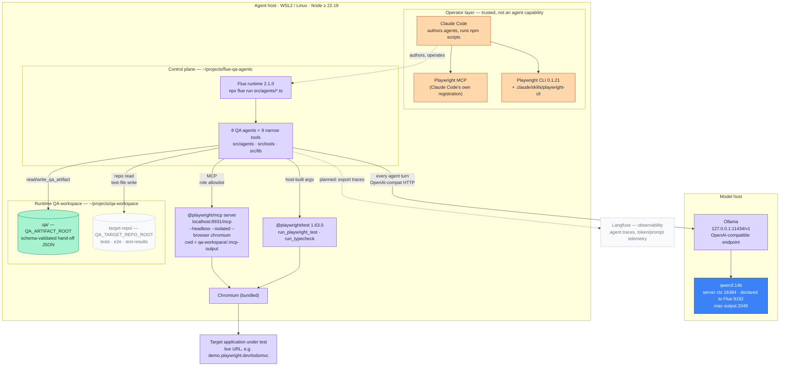
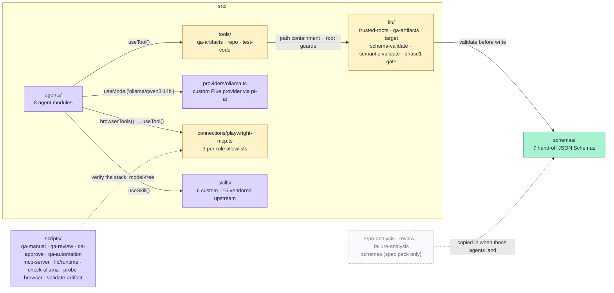

# System Architecture

C4-style view of where every part of Flue QA Agents runs and how the pieces reach each
other. Source of truth: the project [`README.md`](../../README.md) (Environment, security
model, layout) and the spec pack at `../flue-qa-agents-spec-v4`.

## 1. Deployment topology — model host and agent host

Ollama is reached over its OpenAI-compatible HTTP endpoint, so it may run beside the agents or
on another machine. `OLLAMA_BASE_URL` selects it; `npm run check:ollama` prints the right value
when the default loopback address does not reach it.

## 2. Control-plane internals

Every agent file imports the Ollama provider for its side effect
(`import '../providers/ollama.ts'`), because `flue run` loads only the agent module — there is
no shared `app.ts` in this project yet.

`qa-workspace/target-repo/` is shown dashed because no target repository has been placed
there yet, so the repo-read and test-write tools have nothing real to act on. Legend and
component status: [README.md](README.md). Current orchestration:
[two-phase-workflow.md](two-phase-workflow.md).
