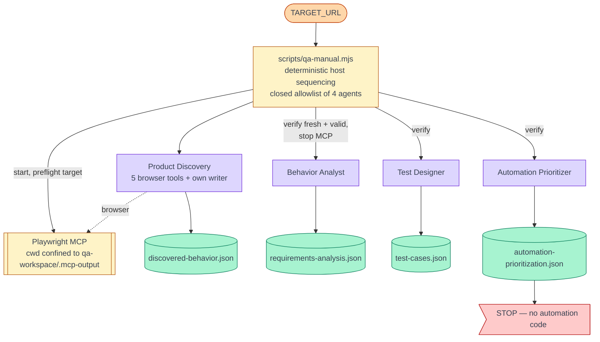
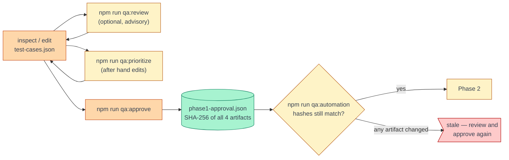

# Two-phase QA workflow

**Current architecture as of 2026-09-22.**

```text
PHASE 1 — Manual QA Design
        ↓
   HUMAN APPROVAL GATE
        ↓
PHASE 2 — Automation Engineering
```

The boundary exists because an AI deciding its own work is finished is not a sufficient
reason to spend effort generating automation from it. Phase 1 produces a complete manual test
suite and a recommendation for which cases to automate. A person then inspects, edits, and
approves it. Phase 2 starts only from that approved, hash-locked content.

---

## Phase 1 — Manual QA Design



`npm run qa:manual` (alias `npm run qa`):

1. Validate `TARGET_URL`; archive the previous run's artifacts into `.qa/archive/<timestamp>/`
   — along with any review and approval, which a regeneration invalidates.
2. Ensure a **confined** Playwright MCP server and preflight the target.
3. Run each stage **as its own root agent** (`flue run <agent>`), in fixed order.
4. After each stage, host code checks the artifact was **written during this attempt** and
   **re-validates it from disk** (schema + semantic). Failure → retry (4 attempts, alternating a
   corrected continuation with a fresh run), then stop with a resume command.
5. Stop the MCP server after Product Discovery if this run started it.
6. **Stop** after the Prioritizer. Nothing in Phase 1 can reach a Phase 2 agent.

The QA Manager is no longer on this path. Letting the model decide whether to call the next
stage completed the full chain in only some runs; every agent was reliable standalone. The
model-driven path remains available as `npm run qa:agentic` for experiments.

### Phase 1 agents

| Agent | Reads | Writes (only) | Browser |
|---|---|---|---|
| Product Discovery | — | `discovered-behavior` | 5 tools |
| Behavior Analyst | discovery | `requirements-analysis` | — |
| Test Designer | analysis, discovery | `test-cases` | — |
| Automation Prioritizer | test cases, analysis, discovery | `automation-prioritization` | — |
| Test Case Reviewer *(optional, `qa:review`)* | all four | `test-cases-review` | — |

"Writes (only)" is enforced by each agent's `write_qa_artifact` input schema
(`writeQaArtifactToolFor([...])`). The Reviewer **cannot** write `test-cases.json`; the
Prioritizer **cannot** alter a test case. This is not a prompt instruction.

### Two kinds of priority

`test-cases.json` carries **product/test priority** (P0–P3: business risk).
`automation-prioritization.json` carries **automation priority** (HIGH/MEDIUM/LOW/NONE: value
of automating). They are independent — `P0 + MANUAL` and `P2 + AUTOMATION/HIGH` are both valid.

### Manual cases are permanent

The Prioritizer classifies; it never removes. Every test case gets exactly one entry, and
MANUAL cases stay in the suite — only AUTOMATION cases continue into Phase 2.

---

## The human approval gate



- **Approval is host code, not a model.** `phase1-approval.json` is absent from the artifact
  registry the agent tools expose; no agent can read or write it.
- **Approval is bound to content.** It records the SHA-256 of the exact bytes of all four
  Phase 1 artifacts. Changing any of them — by hand, or by re-running a stage — makes it stale.
- **An AI review is never approval.** `qa:review` writes proposals to `test-cases-review.json`
  and changes nothing else; the review is not covered by the hash lock.
- **The operator is the authority on facts.** Hand edits that the semantic validator would
  flag (say, a route you know exists but discovery never saw) block approval by default; you
  can accept them with `npm run qa:approve -- --accept-findings`, and they are recorded in the
  approval. Structural problems — a test case with no prioritization, duplicate IDs, an
  invalid schema — are never overridable.

### Phase 2 entry conditions (`npm run qa:automation`)

Refuses unless, in order:

1. `test-cases.json` exists and is valid;
2. `automation-prioritization.json` exists and is valid;
3. `phase1-approval.json` exists;
4. its status is `APPROVED`;
5. every recorded hash still matches the file on disk;
6. at least one case is `executionMode: AUTOMATION`.

Then it selects the `AUTOMATION` cases, ordered HIGH → LOW. **The Phase 2 pipeline itself is
not implemented yet**; the command stops after verifying the boundary.

---

## Phase 2 — Automation Engineering *(planned)*

```text
approved AUTOMATION cases
   → Repo Analyzer → UI Explorer → Automation Generator
   → automation Reviewer → Test Runner → Failure Analyzer
```

Detail: [agent-workflow.md](agent-workflow.md). Per-stage status: [README.md](README.md).

---

## Invariants and where each is enforced

| Invariant | Enforced by |
|---|---|
| Phase 1 never runs a Phase 2 agent | `PHASE1_AGENTS` allowlist checked at startup in `qa-manual.mjs`; run log records any Phase 2 artifact written |
| Each stage's output is fresh | mtime ≥ attempt start, checked by the orchestrator |
| Each agent writes only its own artifact | `writeQaArtifactToolFor` input schema |
| Evidence IDs resolve; no invented facts | `semantic-validate.ts`, on every write and re-checked by the orchestrator |
| Every test case prioritized exactly once | `validateAutomationPrioritization` |
| `MANUAL`≠`HIGH`, `AUTOMATION`≠`NONE` | `validateAutomationPrioritization` |
| Review references real cases, true counts, consistent status | `validateTestCasesReview` |
| The reviewer changes nothing | tool restriction, plus `qa-review.mjs` hashes the inputs before and after |
| Phase 2 starts only from approved, unchanged content | `phase1-gate.ts` → `checkPhase2Gate()` |
| Browser agents cannot write into the control plane | MCP server cwd = `MCP_OUTPUT_ROOT`; running servers are verified before reuse |

Tests: `npm test` (60 tests: `test/semantic-validate.test.ts`, `test/phase1.test.ts`).
